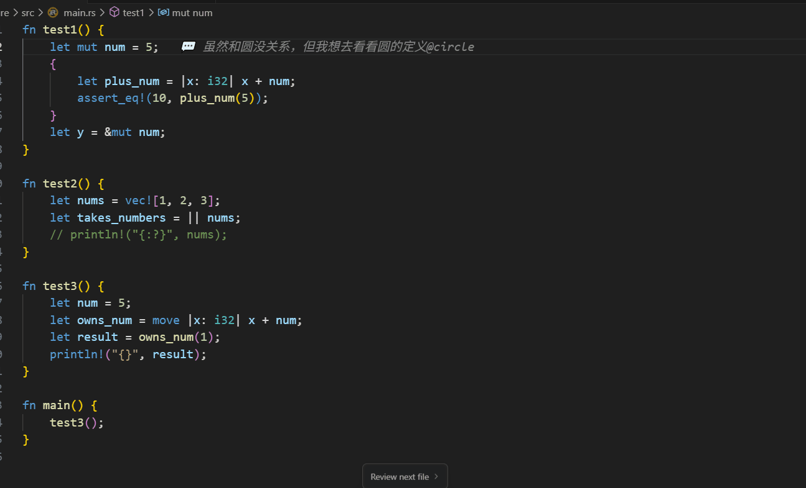
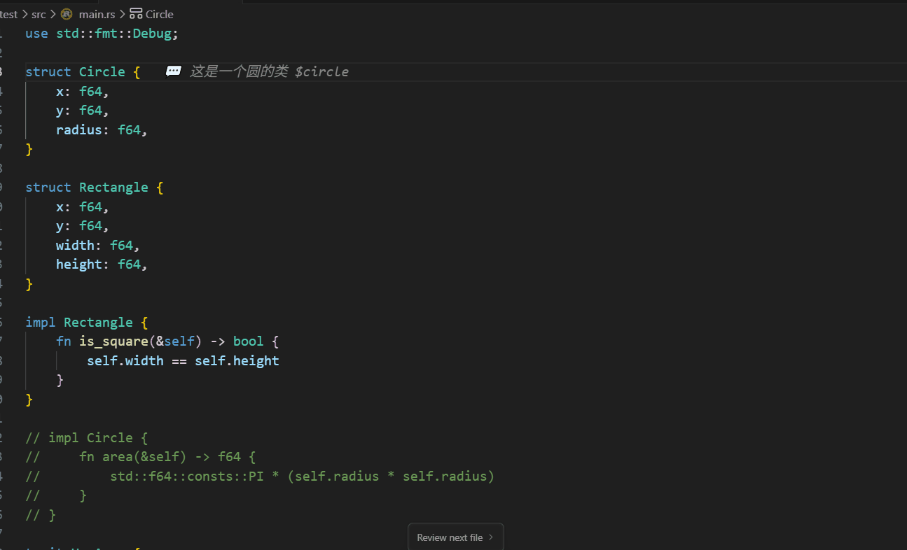

# VSCode 本地注释插件

学习源码，开发陌生项目的辅助工具。

让你可以在代码中添加本地注释,markdown笔记，添加文件跳转tag，修改不会影响原文件或也不会提交到版本控制系统。

### tag跳转


### markdown本地注释


## ✨ 主要功能

### 📝 本地注释
- **添加注释**: 在任意代码行添加本地注释
- **选中转换**: 右键选中的文字可直接转换为本地注释并删除原文字
- **编辑注释**: 随时修改已有的注释内容
- **删除注释**: 轻松删除不需要的注释
- **智能位置跟踪**: 代码变化时自动调整注释位置
- **多行编辑器**: 专业多行注释编辑界面，支持丰富的编辑功能

### 🏷️ 标签系统
- **标签声明**: 使用 `$标签名` 声明标签
- **标签引用**: 使用 `@标签名` 引用标签
- **自动补全**: 输入 `@` 时自动显示可用标签
- **点击跳转**: 点击标签引用直接跳转到声明位置
- **跨文件支持**: 标签可以在不同文件间引用

### 🎨 可视化界面
- **注释显示**: 注释以装饰形式显示在代码行末尾
- **悬停交互**: 鼠标悬停显示编辑和删除选项
- **侧边栏面板**: 查看和管理所有本地注释

### 💾 数据管理
- **本地存储**: 注释数据存储在本地，不会同步到版本控制
- **跨会话持久化**: 重启VSCode后注释依然存在
- **智能备份**: 自动保存，支持手动备份和恢复

## 🚀 快速开始

### 安装
1. 打开VSCode
2. 按 `Ctrl+Shift+X` 打开扩展面板
3. 搜索 "本地注释"
4. 点击安装

### 基本使用

#### 添加注释
1. 将光标放在要添加注释的代码行
2. 按 `Ctrl+Shift+C` 或右键选择"添加本地注释"
3. 输入注释内容

#### 选中文字转换为注释
1. 选中要转换为注释的文字
2. 右键选择"转换为本地注释"
3. 选中的文字变成注释，原位置的代码被删除

#### 多行编辑
1. 悬停在已有注释上
2. 点击"📝 Markdown编辑"按钮
3. 使用可调整大小的多行编辑器
4. 支持上下文显示、标签自动补全和快捷键

#### 使用标签
```javascript
let userConfig = {};  // 本地注释: 这里是$userConfig的声明地方

function loadConfig() {
    // 本地注释: 这里加载@userConfig的配置
    userConfig = JSON.parse(localStorage.getItem('config'));
}
```

## 📋 功能详解

### 键盘快捷键
- `Ctrl+Shift+C`: 添加本地注释
- `Ctrl+Shift+E`: 编辑当前行注释
- `Ctrl+Shift+D`: 删除当前行注释

### 标签功能
- **声明标签**: `$标签名` - 在注释中声明一个标签
- **引用标签**: `@标签名` - 引用已声明的标签
- **自动补全**: 输入 `@` 时显示可用标签列表
- **跳转功能**: 点击 `@标签名` 跳转到 `$标签名` 的位置

### 注释管理
- **侧边栏面板**: 在资源管理器中查看"本地注释"面板
- **注释清单**: 显示所有文件的注释列表
- **快速跳转**: 点击注释项目跳转到对应位置
- **批量操作**: 在面板中编辑或删除注释

### 智能特性
- **位置跟踪**: 代码变化时自动调整注释位置
- **内容匹配**: 通过行内容智能重新定位注释
- **跨文件引用**: 标签可以在不同文件间建立关联

## 📊 使用统计

使用命令面板 (`Ctrl+Shift+P`) 搜索以下命令：

- **显示注释统计**: 查看注释数量、标签统计等信息
- **显示存储位置**: 查看注释数据的存储位置

## 💾 数据存储

### 存储位置
- **Windows**: `%APPDATA%/Code/User/globalStorage/vscode-local-comment/local-comments.json`
- **macOS**: `~/Library/Application Support/Code/User/globalStorage/vscode-local-comment/local-comments.json`
- **Linux**: `~/.config/Code/User/globalStorage/vscode-local-comment/local-comments.json`

### 数据特性
- 注释数据仅存储在本地
- 不会被提交到版本控制系统
- 支持手动备份和恢复
- 跨VSCode会话持久化

## 🎯 使用场景

### 1. 代码理解
```javascript
function complexAlgorithm() {  // 本地注释: $complexAlgorithm核心算法
    // 复杂的算法实现
}

// 在其他地方
if (needOptimization) {  // 本地注释: 这里可能需要优化@complexAlgorithm
    complexAlgorithm();
}
```

### 2. 临时标记
```javascript
const API_KEY = 'xxx';  // 本地注释: $API_KEY需要从环境变量获取

fetch(url, {
    headers: { 'Authorization': API_KEY }  // 本地注释: 使用@API_KEY进行认证
});
```

### 3. 学习笔记
```javascript
class EventEmitter {  // 本地注释: $EventEmitter观察者模式实现
    on(event, callback) {  // 本地注释: 注册事件监听器
        // 实现代码
    }
}

emitter.on('data', handler);  // 本地注释: 监听@EventEmitter的data事件
```

## 🔧 开发

### 构建项目
```bash
npm install
npm run compile
```

### 调试
1. 按 `F5` 启动调试
2. 在新的VSCode窗口中测试插件

## 📝 更新日志

### 变更日志

## [1.0.1] - 2025-05-30

### 🎉 新增功能

- ✨ **选中文字转换为注释**: 右键选中的文字，可直接转换为本地注释并删除原文字
- 📝 **多行编辑器**: 新增专业的多行注释编辑界面，支持丰富的编辑功能
- 🎨 **双重编辑模式**: 
  - 快捷模式：单行快速编辑
  - 详细模式：多行富文本编辑
- ⌨️ **增强快捷键**: 
  - Ctrl+Enter: 保存编辑
- 🏷️ **改进的标签补全**: 编辑器中输入@时自动显示标签下拉列表
- 🖱️ **悬停操作按钮**: 
  - ✏️ 编辑：快速单行编辑
  - 📝 Markdown编辑：多行详细编辑  
  - 🗑️ 删除：删除注释

### 📖 新增使用场景

#### 快速标记代码段
1. 选中需要标记的代码
2. 右键选择"转换为本地注释"
3. 选中的代码变成注释，原代码自动删除

#### 编写长注释
1. 悬停在注释上
2. 点击"📝 Markdown编辑"
3. 在多行编辑器中写入详细说明
4. 支持换行符(\n)和标签引用

## [1.0.0] - 2025-05-29

### 新增功能
- ✨ 本地注释功能：在代码中添加本地注释，不修改原文件
- 🏷️ 标签系统：支持 `$标签名` 声明和 `@标签名` 引用
- 🔗 智能跳转：点击标签引用可跳转到声明位置
- 💡 自动补全：输入 `@` 时自动提示可用标签
- 🌲 树形视图：在侧边栏查看所有注释
- ⌨️ 快捷键支持：Ctrl+Shift+C 添加注释
- 🎨 语法高亮：标签在注释中高亮显示
- 📁 跨文件支持：标签可在不同文件间引用

## 📄 License

MIT License
